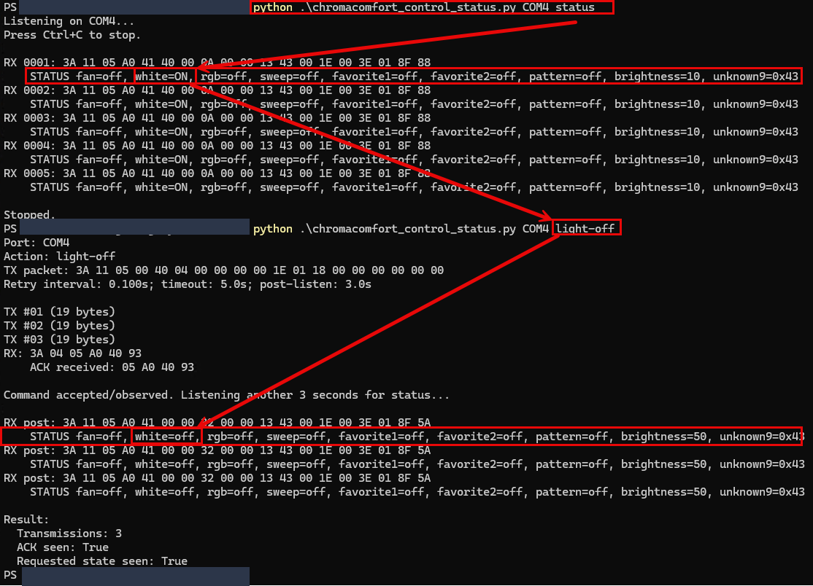

# ChromaComfort Control & Status

This project provides tools and scripts to control and monitor the ChromaComfort speaker (and fan/light/rgb) via Bluetooth serial communication.

This was developed based on the work of [taylorfinnell](https://gist.github.com/taylorfinnell/5349b8085d57836a45be7637055e0692), who provided a foundational understanding of the Bluetooth serial connection for the ChromaComfort speaker. The scripts allow users to send commands to the device and receive status updates.

This project was research done to facilitate control of the device in HomeAssistant without using a dedicated ESP32 device, but rather a python script running on a computer that can connect to the device via Bluetooth. The goal is to allow for more flexible control and monitoring of the ChromaComfort speaker in a home automation setup.

## Acknowledgements

This project was made possible thanks to prior work by [taylorfinnell](https://gist.github.com/taylorfinnell/5349b8085d57836a45be7637055e0692), whose gist provided valuable insight into the Bluetooth serial connection for the ChromaComfort speaker. Additional functionality was developed through trial and error based on that foundation.

## Longterm goal:

Create a companiion that will allow control of the fan, lights, and speaker and bridge the bluetooth speaker to an AirPlay or other streaming protocol, so that the ChromaComfort speaker can be used as a smart speaker in a home automation setup.  The speaker/fan/light combo supports a single paried device, so any attempt to fully control the device with realtime status updates results in the inability to using bluetooth speaker functionality. By creating a companion that can bridge the bluetooth speaker to a streaming protocol, the device can be used as a smart speaker in a home automation setup.

## General Steps to Use

1. **Connect to the ChromaComfort Speaker via Bluetooth:**  
   Pair your computer with the ChromaComfort speaker using your operating system's Bluetooth settings.

2. **Identify the Bluetooth Serial Port:**  
   Determine which serial port (COM port on Windows, /dev/tty.* on macOS/Linux) is assigned for controlling the device.

3. **Run the Python Script:**  
   Use the provided Python script to interact with the device over the identified Bluetooth serial port.


## Requirements

- Python 3.x
- `pyserial` library (`pip install pyserial`)

## Usage

Identify the serial port after pairing with the ChromaComfort speaker. Then, run the script with the appropriate command-line arguments to control or monitor the device.

```
python .\chromacomfort_control_status.py COM4 status

python .\chromacomfort_control_status.py COM4 fan-on
python .\chromacomfort_control_status.py COM4 fan-off
python .\chromacomfort_control_status.py COM4 light-on
python .\chromacomfort_control_status.py COM4 light-off
python .\chromacomfort_control_status.py COM4 rgb-on
python .\chromacomfort_control_status.py COM4 rgb-off

```
After a successful command it keeps listening for another 3 seconds, so you should see the ACK and then the updated status, for example:
```
ACK received: 05 A0 40 93

RX post: 3A 11 05 A0 41 40 00 0A ...
    STATUS fan=off, white=ON, rgb=off, brightness=10

Result:
  ACK seen: True
  Requested state seen: True
```
Seeing Reqwuest state seen: True isn't always reliable -- more reserach needs to be done to determine if the device is actually in the requested state.

Refer to the script for available commands and options.

An example is shown below with the light turned on iniitally.  The light is then turned off using the script.

|  |
|-------------------------------|