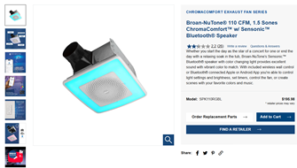

# ChromaComfort Home Assistant + AirPlay Bridge

This project provides Python tools and a tested Linux bridge for controlling and monitoring a Broan/NuTone ChromaComfort-Sensonic fan/light/speaker over Bluetooth Classic.

https://broan-nutone.com/en-us/product/ventilationfans/spk110rgbl

|  |
|--------------------|

The Linux integration provides:

- Home Assistant control/status over MQTT using Bluetooth RFCOMM/SPP
- AirPlay audio to the ChromaComfort Bluetooth speaker using Shairport Sync, PipeWire/WirePlumber, and BlueZ A2DP
- Home Assistant-triggered local alert sounds mixed into the same PipeWire/A2DP output
- Boot-time recovery for BlueZ, A2DP sink creation, and Shairport startup ordering

The Linux bridge owns the ChromaComfort Bluetooth relationship and exposes higher-level network interfaces to the rest of the home.

## Validated test platform

- **Computer:** Lenovo ThinkCentre M625q Tiny
- **Architecture:** x86-64
- **CPU:** AMD A4-9120e
- **Bluetooth adapter:** TP-Link UB500 Plus USB Bluetooth adapter
- **Operating system:** Ubuntu 26.04.1 LTS
- **Audio stack:** PipeWire / pipewire-alsa / pipewire-pulse / WirePlumber
- **Bluetooth stack:** BlueZ
- **AirPlay:** Shairport Sync 4.3.7, ALSA backend through PipeWire, 0.5-second backend buffer

Other Linux hardware may work but is unvalidated unless specifically noted.

## Architecture

```text
                                      ChromaComfort-Sensonic
                                      /                    \
                             RFCOMM / SPP                A2DP
                                   /                        \
                   chromacomfort_bridge.py               BlueZ
                              |                             |
                             MQTT                    PipeWire/WirePlumber
                              |                       /             \
                       Home Assistant        Shairport Sync      Alert WAVs
                                                  |                  |
                                             ALSA/PipeWire       MQTT trigger
                                                  |                  |
                                               AirPlay          Home Assistant
```

## Home Assistant features

MQTT Discovery is published automatically for fan, white-light, RGB, wall-RGB, bridge diagnostics, audio diagnostics, and local alert playback. No manual Home Assistant entity YAML is required when MQTT discovery is enabled.


### Sound Notifications

Home Assistant can trigger built-in `doorbell`, `complete`, `alert`, and `notification` WAV sounds by publishing the name to `<topic_prefix>/audio/play`. Alerts use `pw-play` directly against the ChromaComfort PipeWire A2DP sink and can mix with active AirPlay audio.

See [docs/ALERTS.md](docs/ALERTS.md) for examples.

## AirPlay audio path

The tested Shairport Sync package does not contain the native PipeWire backend. The reference path is:

```text
AirPlay -> Shairport Sync -> ALSA -> pipewire-alsa -> PipeWire -> BlueZ A2DP -> ChromaComfort
```

The project originally used Shairport's PulseAudio (`pa`) backend through `pipewire-pulse`. Testing found a reproducible pause/resume failure: after pausing Spotify/AirPlay, the Shairport stream became `pulse.corked=true`; playback could report resumed while the stream remained corked and silent. Restarting Shairport temporarily recovered it.

Switching Shairport to its ALSA backend with `output_device = "pipewire"` eliminated the tested pause/resume failure. Initial ALSA playback was then audibly choppy/clipping-like with the smaller backend buffer. Setting:

```conf
audio_backend_buffer_desired_length_in_seconds = 0.5;
```

eliminated the observed dropouts on the reference host. The installer therefore installs `pipewire-alsa` and generates the ALSA-backed Shairport configuration with the 0.5-second backend buffer by default. The updater migrates existing managed installations to the same configuration.

The boot services also recover behaviors observed with the tested device:

- BlueZ can occasionally be unresponsive immediately after boot.
- RFCOMM can make Bluetooth report connected while the A2DP sink is still missing.
- Shairport can start before the A2DP sink exists, resulting in silent AirPlay until restarted.

`chromacomfort-audio-ready.service` verifies the actual A2DP sink and restarts Shairport only after audio transport is ready.

## Quick Linux installation

See [LINUX.md](LINUX.md) for full setup and troubleshooting.

```bash
git clone https://github.com/Relkci/ChromaComfort-Python-Control.git
cd ChromaComfort-Python-Control
sudo bash scripts/install-linux.sh
```

Pair and trust the ChromaComfort with BlueZ as documented in `LINUX.md`. The tested unit may request legacy PIN `1234`.

For an existing installation:

```bash
cd /opt/ChromaComfort-Python-Control
git pull
sudo bash scripts/update-linux.sh
```

The updater installs `pipewire-alsa` if required and refreshes the managed Shairport configuration. On first migration it saves the previous configuration as `shairport-sync.conf.pre-alsa-migration`.

## Windows / direct serial utility

`chromacomfort_control_status.py` can still be used directly with a paired serial port:

```powershell
python .\chromacomfort_control_status.py COM4 status
python .\chromacomfort_control_status.py COM4 fan-on
python .\chromacomfort_control_status.py COM4 fan-off
python .\chromacomfort_control_status.py COM4 light-on
python .\chromacomfort_control_status.py COM4 light-off
python .\chromacomfort_control_status.py COM4 rgb-on
python .\chromacomfort_control_status.py COM4 rgb-off
```

## Linux components

```text
chromacomfort_bridge.py                 MQTT/RFCOMM bridge
chromacomfort_audio_status.py           MQTT audio health + alert listener
config/chromacomfort.conf.example       bridge configuration example
systemd/                                system services and boot readiness
scripts/install-linux.sh                guided Linux installer
scripts/update-linux.sh                 existing-installation updater
scripts/generate-alert-sounds.py        built-in WAV generator
scripts/chromacomfort-status.sh         one-command diagnostics
scripts/chromacomfort-bluetooth-ready.sh
scripts/chromacomfort-audio-ready.sh.example
wireplumber/                            headless Bluetooth/audio rules
shairport/                              AirPlay configuration/service template
docs/ALERTS.md                          alert-sound usage
docs/BOOT-AND-SERVICE-FLOW.md           boot order and audio/control readiness
docs/DIAGNOSTICS.md                     focused troubleshooting
LINUX.md                                full Linux documentation
```

## Tested behavior

The current implementation has been validated with simultaneous RFCOMM control and A2DP audio. Fan/light/RGB controls remain functional while AirPlay is in use. AirPlay initial playback, track changes, pause/resume, sustained clean playback with the 0.5-second backend buffer, source-volume control, reboot recovery, and Home Assistant-triggered local WAV alerts have been exercised on the reference host. Alerts can mix into active AirPlay through PipeWire without stopping Shairport.

Bluetooth implementations and ChromaComfort hardware revisions may differ, so verify the Serial Port RFCOMM channel with `sdptool browse <MAC>` rather than assuming channel 7 universally.

## Acknowledgements

This project builds on the reverse-engineering work of [Taylor Finnell](https://gist.github.com/taylorfinnell/5349b8085d57836a45be7637055e0692), which provided the foundational ChromaComfort Bluetooth serial protocol behavior. Additional Linux, MQTT, Home Assistant, RGB/brightness, boot recovery, AirPlay integration, and local alert playback behavior was developed and validated experimentally.
